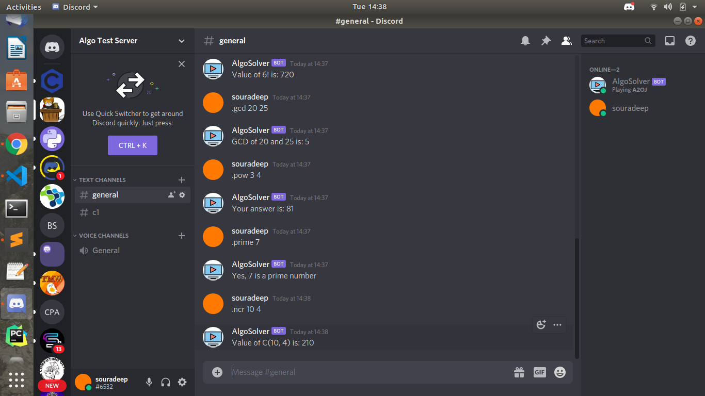

# AlgoSolver
A simple Discord bot that assists with programming. AlgoSolver can solve various mathematical and algorithmic problem when the associated command is invoked. Some screenshots of the AlgoSolver is below,

